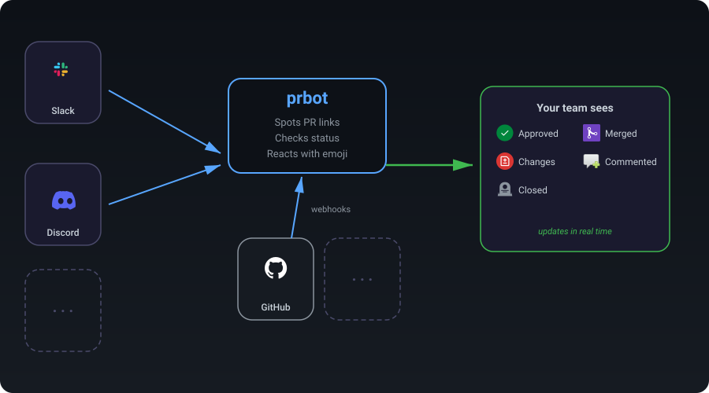

# prbot

A bot that watches for GitHub PR URLs in your messages and reacts with emoji reflecting the PR's current status. When a PR's status changes, the bot automatically updates the reaction.

<p align="center">
  
</p>

### Features

- **Automatic PR detection** — spots GitHub PR links in your messages, no commands needed
- **Live status emoji** — reacts with an emoji that reflects the current PR state (open, approved, merged, etc.)
- **Real-time updates** — emoji updates automatically when the PR status changes via GitHub webhooks
- **Multi-platform** — works with Slack, Discord, and designed to support more integrations
- **Customisable emoji** — configure which emoji maps to which status, per workspace or channel
- **Backfill on startup** — catches any PR messages posted while the bot was offline

## Documentation

Full documentation is available at **[feds01.github.io/prbot](https://feds01.github.io/prbot)**.

- [Getting Started](https://feds01.github.io/prbot/getting-started/) — install and run locally
- [Slack Integration](https://feds01.github.io/prbot/integrations/slack/) — create a Slack app
- [GitHub Integration](https://feds01.github.io/prbot/integrations/github/) — create a GitHub App
- [Configuration](https://feds01.github.io/prbot/configuration/) — environment variables & custom emoji
- [Deployment](https://feds01.github.io/prbot/deployment/) — Fly.io, Docker & self-hosting

## Quick start

```sh
git clone git@github.com:feds01/prbot.git
cd prbot
just install
cp .env.example .env  # fill in credentials
just dev
```

## Development

```sh
just check       # lint + format + typecheck + migration check
just test        # run tests
just docs        # serve docs locally
```

## License

MIT
