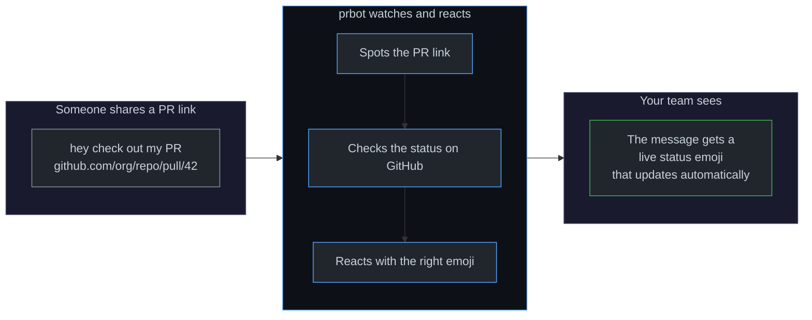

# prbot

A bot that watches for GitHub PR URLs in your messages and reacts with emoji reflecting the PR's current status. When a PR's status changes, the bot automatically updates the reaction.



Works with **Slack**, **Discord**, and more integrations coming soon.

| PR Status         | Emoji                      |
| ----------------- | -------------------------- |
| Open              | :eyes:                     |
| Approved          | :white_check_mark:         |
| Changes requested | :arrows_counterclockwise:  |
| Commented         | :speech_balloon:           |
| Merged            | :tada:                     |
| Closed            | :x:                        |

## Documentation

Full documentation is available at **[feds01.github.io/prbot](https://feds01.github.io/prbot)**.

- [Getting Started](https://feds01.github.io/prbot/getting-started/) — install and run locally
- [Slack Integration](https://feds01.github.io/prbot/integrations/slack/) — create a Slack app
- [GitHub Integration](https://feds01.github.io/prbot/integrations/github/) — create a GitHub App
- [Configuration](https://feds01.github.io/prbot/configuration/) — environment variables & custom emoji
- [Deployment](https://feds01.github.io/prbot/deployment/) — Fly.io, Docker & self-hosting

## Quick start

```sh
git clone git@github.com:feds01/prbot.git
cd prbot
just install
cp .env.example .env  # fill in credentials
just dev
```

## Development

```sh
just check       # lint + format + typecheck + migration check
just test        # run tests
just docs        # serve docs locally
```

## License

MIT
