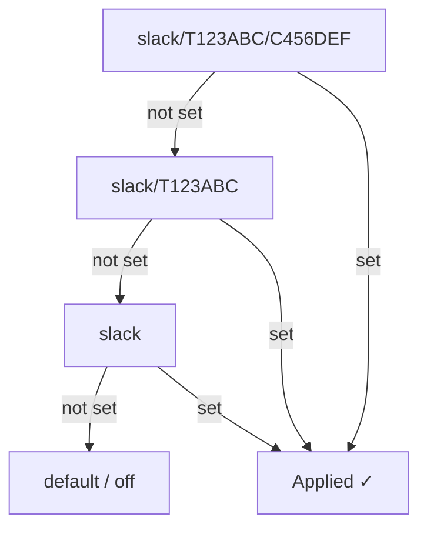

# Commands

prbot exposes a single `/prbot` slash command. All configuration lives under `/prbot config`, organised by **domain**.

```
/prbot                                  → top-level help
/prbot config                           → current scope summary
/prbot config <domain>                  → list actions for that domain
/prbot config <domain> <action> [args]  → perform an action
```

Typing any path with an unknown domain or action prints the help for that nesting level, so you can discover the surface by making typos.

## Scope levels

Most actions accept an optional scope argument as their last positional:

| Level | Applies to | Example scope key |
| ----- | ---------- | ----------------- |
| `channel` (default) | Current channel only | `slack/T123ABC/C456DEF` |
| `workspace` | All channels in the workspace | `slack/T123ABC` |

If omitted, actions that mutate state target the **current channel**. Read-only actions default to the full hierarchy (channel → workspace → global) so inherited values surface.

## Domains

### `exclusions`

Exclude GitHub users from triggering PR status emoji updates.

```
/prbot config exclusions add <username> [channel|workspace]
/prbot config exclusions remove <username> [channel|workspace]
/prbot config exclusions list [channel|workspace]
```

**Examples:**
```
/prbot config exclusions add Cursor                # exclude in this channel
/prbot config exclusions add Cursor workspace      # exclude across the workspace
/prbot config exclusions list                      # show all applicable exclusions
/prbot config exclusions remove Cursor workspace   # re-include at workspace level
```

A user excluded at **any** matching scope is considered excluded — a workspace-level exclusion applies to every channel in that workspace.

---

### `self-reviews`

Suppress the `commented` emoji reaction when a PR author comments on their own PR. (`approve` and `request_changes` aren't possible on your own PR, so only `commented` is affected in practice.)

```
/prbot config self-reviews mute [channel|workspace]
/prbot config self-reviews unmute [channel|workspace]
/prbot config self-reviews status [channel|workspace]
```

**Examples:**
```
/prbot config self-reviews mute workspace      # stop reacting to self-reviews across the workspace
/prbot config self-reviews status              # show where self-reviews are muted
```

When muted at any matching scope, comment-only review events from the PR author are silently skipped — no emoji is added or updated for their own PR comments.

---

### `emoji`

Show the emoji config effective at a scope. Custom overrides are read-only from slash commands for now.

```
/prbot config emoji status [channel|workspace]
```

## Summary view

`/prbot config` (no domain) renders a compact summary for the current scope, showing only the sections that have non-default state — e.g.:

```
Scope: slack/T123ABC/C456DEF
Excluded users:
  • Workspace (slack/T123ABC): Cursor
Self-reviews: muted at Workspace (slack/T123ABC)
Emoji config:
  merged: git-merged
  closed: headstone
  approved: git-approved
  changes requested: git-changes-requested
  commented: speech_balloon

Type `/prbot config <domain>` to see available actions.
```

## Scope resolution

When checking whether a user is excluded or whether self-reviews are muted, prbot walks from most-specific to least-specific:



## Slack app setup

The `/prbot` slash command is defined in the [Slack app manifest](integrations/slack.md). If you created your app from the manifest, no additional setup is needed — just reinstall the app after updating.
