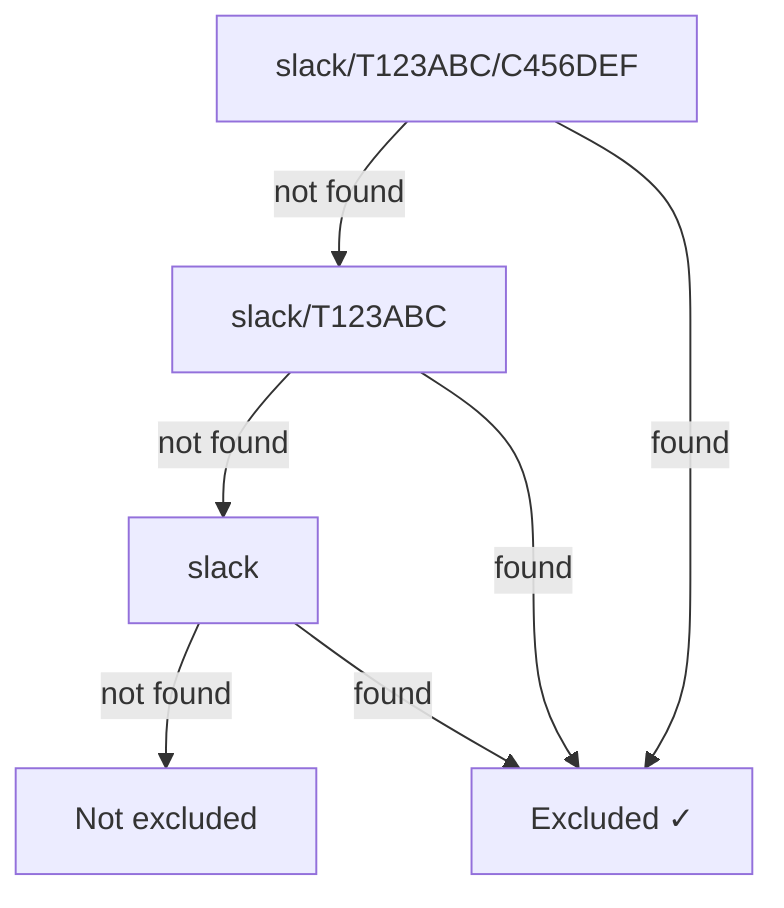

# Commands

prbot exposes a `/prbot` slash command in Slack for managing configuration. Commands default to the **current channel's scope**, but you can pass an optional scope level to target a broader scope.

## Scope levels

Most commands accept an optional scope argument:

| Level | Applies to | Example scope key |
| ----- | ---------- | ----------------- |
| `channel` (default) | Current channel only | `slack/T123ABC/C456DEF` |
| `workspace` | All channels in the workspace | `slack/T123ABC` |

If omitted, commands default to `channel`.

## Available commands

### `exclude`

Exclude a GitHub username from triggering PR status emoji updates.

```
/prbot exclude <username> [channel|workspace]
```

**Examples:**

```
/prbot exclude Cursor                # exclude in this channel
/prbot exclude Cursor workspace      # exclude across the workspace
/prbot exclude dependabot[bot]       # exclude in this channel
```

Events from excluded users are silently skipped — no emoji reactions are added or updated for their PR activity.

---

### `include`

Re-include a previously excluded GitHub username.

```
/prbot include <username> [channel|workspace]
```

**Examples:**

```
/prbot include Cursor                # re-include in this channel
/prbot include Cursor workspace      # re-include at the workspace level
```

---

### `list-exclusions`

Show all excluded GitHub usernames for a scope.

```
/prbot list-exclusions [channel|workspace]
```

Alias: `/prbot exclusions`

**Examples:**

```
/prbot list-exclusions               # show channel exclusions
/prbot list-exclusions workspace     # show workspace exclusions
```

---

### `config`

Show the full configuration for a scope, including emoji settings and excluded users.

```
/prbot config [channel|workspace]
```

**Example output:**

```
Scope: slack/T123ABC/C456DEF
Excluded users: `Cursor`, `dependabot[bot]`
Emoji config:
  merged: git-merged
  closed: headstone
  approved: git-approved
  changes requested: git-changes-requested
  commented: speech_balloon
```

---

### `help`

Show the list of available commands. This is also shown when an unrecognised command is entered.

```
/prbot help
```

## Scope resolution

When checking whether a user is excluded, prbot walks from most-specific to least-specific:



This means a workspace-level exclusion applies to **all channels** within that workspace, even without being set per-channel.

## Slack app setup

The `/prbot` slash command is included in the [Slack app manifest](integrations/slack.md). If you created your app from the manifest, no additional setup is needed — just reinstall the app after updating.
