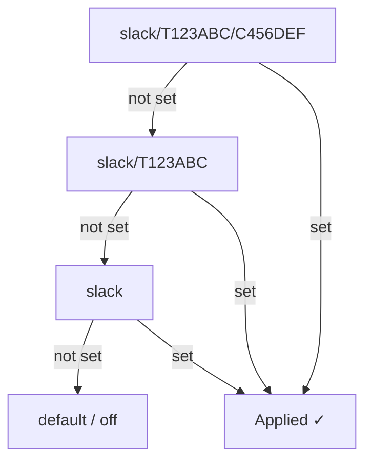

# Commands

prbot exposes `/prbot` as a slash command in both Slack and Discord. Every configuration action lives under a named **domain** at the top level:

```
/prbot                                  → top-level help
/prbot config                           → current scope summary
/prbot <domain>                         → list actions for that domain
/prbot <domain> <action> [args]         → perform an action
```

The older `/prbot config <domain> <action>` form continues to work for backward compatibility.

Typing any path with an unknown domain or action prints the help for that nesting level, so you can discover the surface by making typos.

## Scope levels

Most actions accept an optional scope argument as their last positional:

| Level | Applies to | Example scope key |
| ----- | ---------- | ----------------- |
| `channel` (default) | Current channel only | `slack/T123ABC/C456DEF` |
| `workspace` | All channels in the workspace/guild | `slack/T123ABC` |

If omitted, actions that mutate state target the **current channel**. Read-only actions default to the full hierarchy (channel → workspace → global) so inherited values surface.

## Domains

### `exclusions`

Exclude GitHub users from triggering PR status emoji updates.

```
/prbot exclusions add <username> [channel|workspace]
/prbot exclusions remove <username> [channel|workspace]
/prbot exclusions list [channel|workspace]
/prbot exclusions check [channel|workspace]
```

**Examples:**
```
/prbot exclusions add Cursor                # exclude in this channel
/prbot exclusions add Cursor workspace      # exclude across the workspace
/prbot exclusions list                      # show all applicable exclusions
/prbot exclusions check                     # re-verify each entry against GitHub
/prbot exclusions remove Cursor workspace   # re-include at workspace level
```

A user excluded at **any** matching scope is considered excluded — a workspace-level exclusion applies to every channel in that workspace.

**Validation.** `add` resolves the login against GitHub's users API and surfaces an advisory note when the result is unusual — unknown login, organization, or a GitHub App without the `[bot]` suffix that webhook senders actually carry. The entry is still stored verbatim; the note is informational. Run `check` at any time to re-verify all stored entries (useful for catching renames or users who have left).

---

### `self-reviews`

Suppress the `commented` emoji reaction when a PR author comments on their own PR. (`approve` and `request_changes` aren't possible on your own PR, so only `commented` is affected in practice.)

```
/prbot self-reviews mute [channel|workspace]
/prbot self-reviews unmute [channel|workspace]
/prbot self-reviews status [channel|workspace]
```

**Examples:**
```
/prbot self-reviews mute workspace      # stop reacting to self-reviews across the workspace
/prbot self-reviews status              # show where self-reviews are muted
```

When muted at any matching scope, comment-only review events from the PR author are silently skipped — no emoji is added or updated for their own PR comments.

---

### `emoji`

Show the emoji config effective at a scope. Custom overrides are read-only from slash commands for now.

```
/prbot emoji status [channel|workspace]
```

## Summary view

`/prbot config` (no domain) renders a compact summary for the current scope, showing only the sections that have non-default state — e.g.:

```
Scope: slack/T123ABC/C456DEF
Excluded users:
  • Workspace (slack/T123ABC): Cursor
Self-reviews: muted at Workspace (slack/T123ABC)
Emoji config:
  merged: git-merged
  closed: headstone
  approved: git-approved
  changes requested: git-changes-requested
  commented: speech_balloon

Type `/prbot <domain>` to see available actions.
```

## Scope resolution

When checking whether a user is excluded or whether self-reviews are muted, prbot walks from most-specific to least-specific:



## Platform differences

- **Slack**: `/prbot` is a single free-text slash command. Both `/prbot exclusions add Cursor` and `/prbot config exclusions add Cursor` are accepted.
- **Discord**: `/prbot` is a native slash-command group with typed subcommands (e.g. `/prbot exclusions add`). Parameters are typed and auto-completed by Discord's client.

## Slack app setup

The `/prbot` slash command is defined in the [Slack app manifest](integrations/slack.md). If you created your app from the manifest, no additional setup is needed — just reinstall the app after updating.
