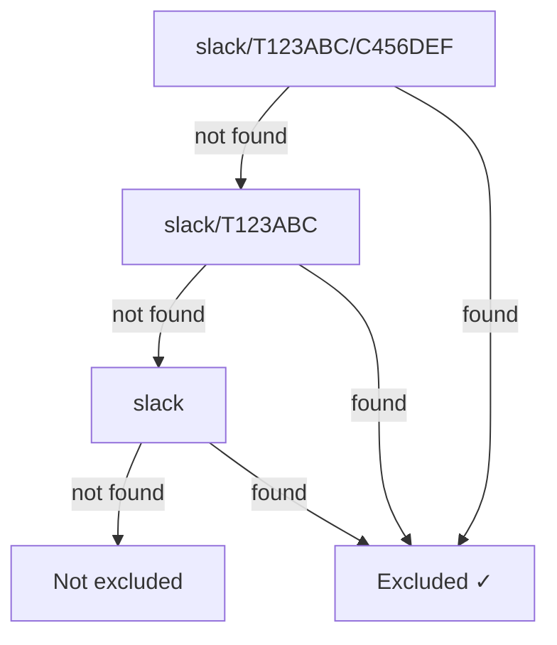

# Commands

prbot exposes a `/prbot` slash command in Slack for managing configuration. All commands operate on the **current channel's scope** — exclusions and settings are scoped to the channel where the command is run.

## Available commands

### `exclude`

Exclude a GitHub username from triggering PR status emoji updates in this channel.

```
/prbot exclude <github-username>
```

**Examples:**

```
/prbot exclude Cursor
/prbot exclude dependabot[bot]
```

Events from excluded users are silently skipped — no emoji reactions are added or updated for their PR activity.

---

### `include`

Re-include a previously excluded GitHub username.

```
/prbot include <github-username>
```

**Example:**

```
/prbot include Cursor
```

---

### `list-exclusions`

Show all excluded GitHub usernames for this channel.

```
/prbot list-exclusions
```

Alias: `/prbot exclusions`

---

### `config`

Show the full configuration for this channel, including emoji settings and excluded users.

```
/prbot config
```

**Example output:**

```
Scope: slack/T123ABC/C456DEF
Excluded users: `Cursor`, `dependabot[bot]`
Emoji config:
  merged: git-merged
  closed: headstone
  approved: git-approved
  changes requested: git-changes-requested
  commented: speech_balloon
```

---

### `help`

Show the list of available commands. This is also shown when an unrecognised command is entered.

```
/prbot help
```

## Scope resolution

Commands always operate on the **most-specific scope** for the channel they're run in. The scope key format is:

```
<integration>/<workspace_or_guild>/<channel>
```

For example, running `/prbot exclude Cursor` in the `#deploys` channel of Slack workspace `T123ABC` stores the exclusion at scope `slack/T123ABC/C456DEF`.

When checking whether a user is excluded, prbot walks from most-specific to least-specific:



This means a workspace-level exclusion (e.g. `slack/T123ABC`) applies to all channels within that workspace.

## Slack app setup

The `/prbot` slash command is included in the [Slack app manifest](integrations/slack.md). If you created your app from the manifest, no additional setup is needed — just reinstall the app after updating.
