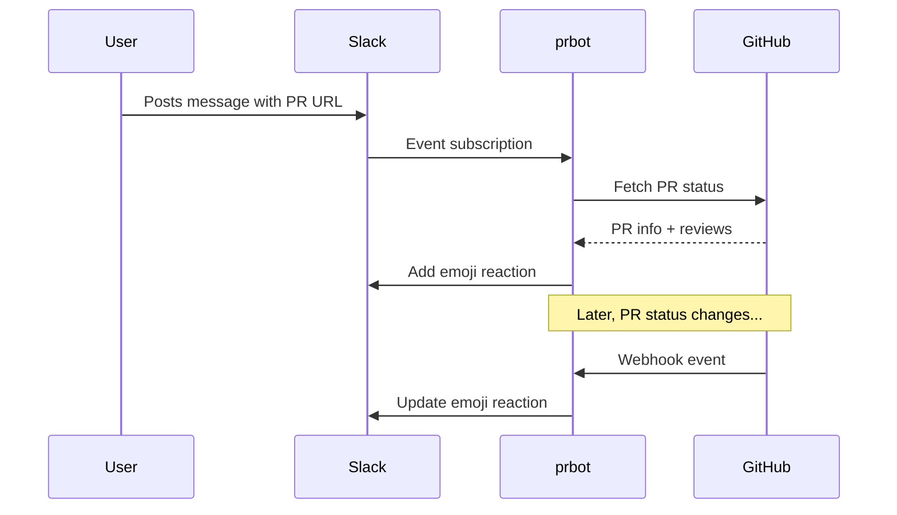

# prbot

A bot that watches for GitHub PR URLs in your messages and reacts with emoji reflecting the PR's current status. When a PR's status changes, the bot automatically updates the reaction.

## How it works

1. A user posts a message containing a GitHub PR URL
2. The bot detects the URL, fetches the PR status from GitHub, and adds an emoji reaction
3. When the PR is updated (opened, closed, reviewed, etc.), a GitHub webhook notifies the bot
4. The bot updates the emoji on all messages tracking that PR

## Default emoji

| PR Status         | Emoji                      |
| ----------------- | -------------------------- |
| Open              | :eyes:                     |
| Approved          | :white_check_mark:         |
| Changes requested | :arrows_counterclockwise:  |
| Commented         | :speech_balloon:           |
| Merged            | :tada:                     |
| Closed            | :x:                        |

All emoji are [configurable](configuration.md) per-instance and per-channel.

## Next steps

-   :material-rocket-launch:{ .lg .middle } **Getting Started**

    ---

    Install prbot and run it locally in under 5 minutes.

    [:octicons-arrow-right-24: Getting started](getting-started.md)

-   :fontawesome-brands-slack:{ .lg .middle } **Slack Integration**

    ---

    Create a Slack app and connect it to prbot.

    [:octicons-arrow-right-24: Slack setup](integrations/slack.md)

-   :fontawesome-brands-github:{ .lg .middle } **GitHub Integration**

    ---

    Create a GitHub App and configure webhooks.

    [:octicons-arrow-right-24: GitHub setup](integrations/github.md)

-   :material-cog:{ .lg .middle } **Configuration**

    ---

    Customise emoji, scopes, and all available settings.

    [:octicons-arrow-right-24: Configuration](configuration.md)

