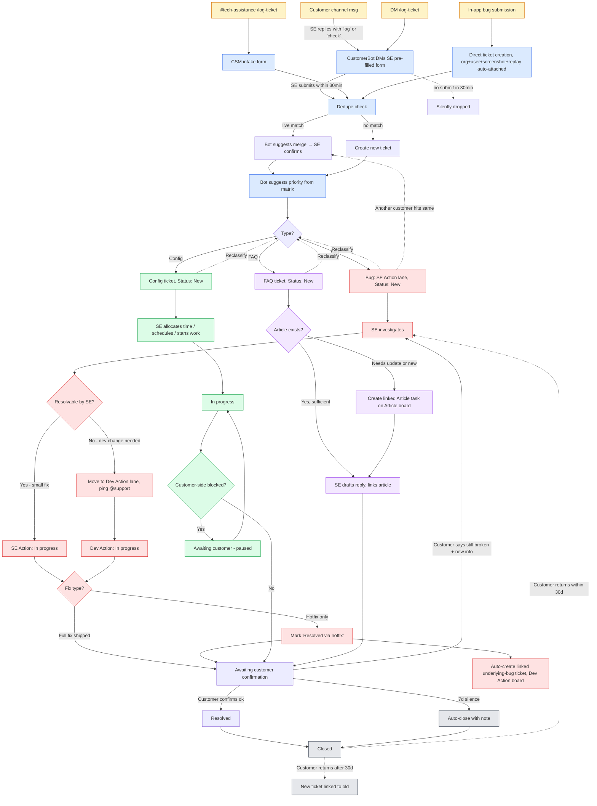
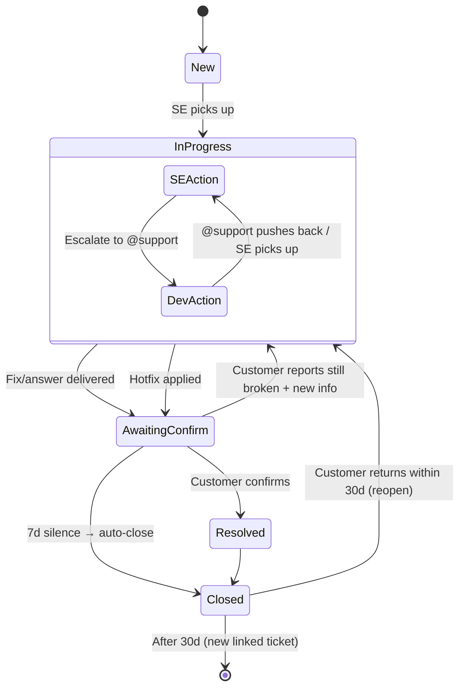
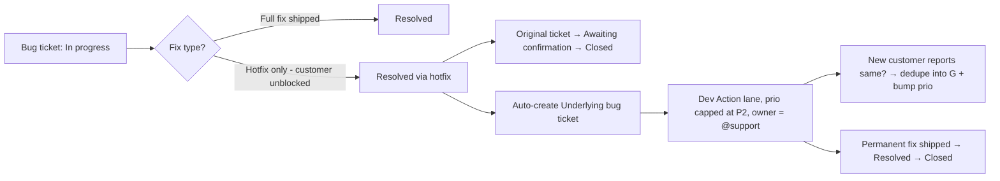
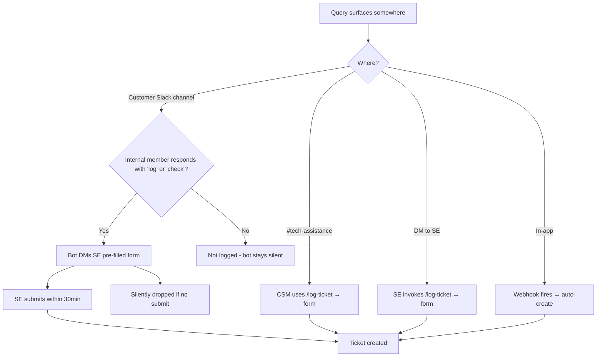
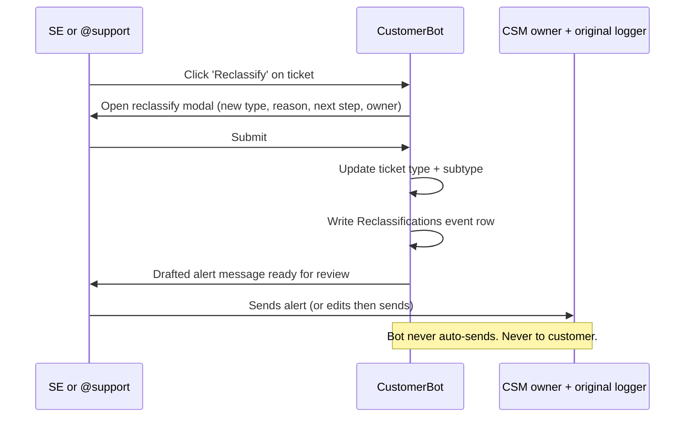
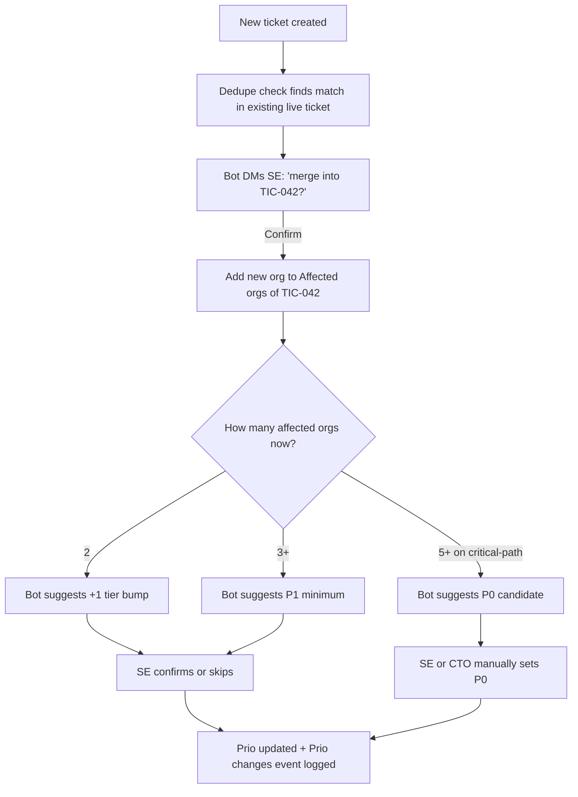

# SE Ticketing Flow — v1 Diagrams

Mermaid replacement for the v0 Figma diagram. Paste into Notion or any Mermaid renderer.

Companion to `se-ticketing-flow-v1.md` (canonical spec).

---

## 1. End-to-end flow

---

## 2. Ticket lifecycle (state machine)

---

## 3. Bug-specific: hotfix fork

---

## 4. Intake decision tree

---

## 5. Reclassification flow

---

## 6. Multi-customer prio bump

---

## 7. Comparison with v0 (what changed)

| v0 | v1 | Why |
|---|---|---|
| 3 linear branches | 3 types + lanes + statuses + loopbacks | Real flow has cycles (customer disputes, reclass, multi-customer) |
| Triage at intake fixes type | Reclassify any time | Initial classification is often wrong |
| "Resolved" = closed | Resolved → Awaiting confirmation → Closed (with 7d auto-close, 30d reopen) | Customer confirmation matters; silence shouldn't block close forever |
| Bug: SE writeup → Dev → SE → close | One board, lanes (SE Action / Dev Action), button-driven | Cleaner ownership signal for CSMs |
| No hotfix concept | Hotfix forks into linked underlying bug | Captures tech-debt backlog |
| No prio | P0–P4 + matrix + soft SLAs + multi-customer bumps | Tier-and-time discipline |
| Implicit assignment to SE | Explicit lane, fallback to Tristan for P0/P1 OOO | Single-point-of-failure mitigation |
| No metadata capture | Event logs (status, prio, reclass, comms) | Reporting from day one |
| Customer comms freeform | Bot drafts at every key moment; SE/CSM always sends | Consistency + speed without bot autonomy on customer messaging |
